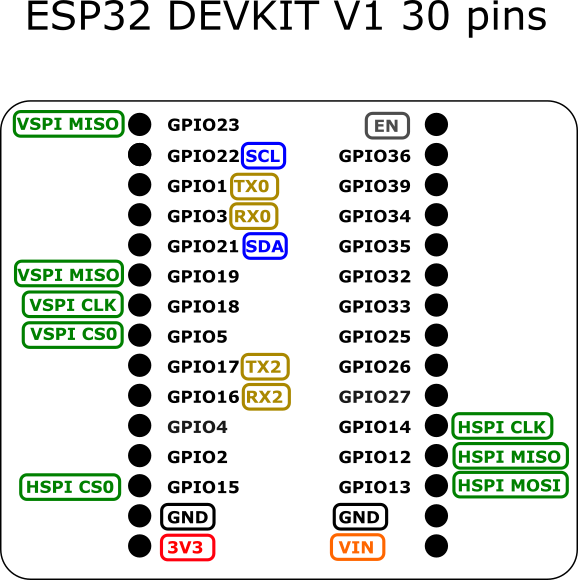
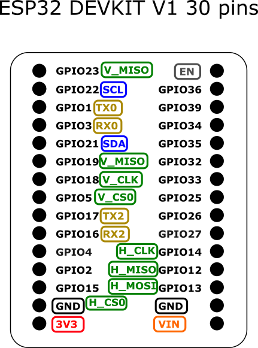
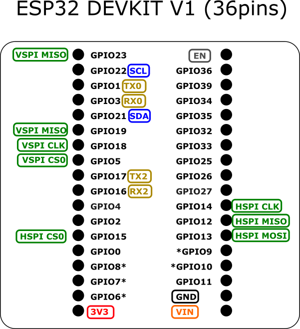
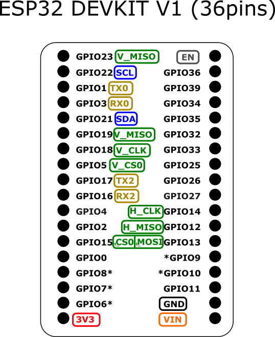

# ESP32 Leaf Pinout
esp32-leaf pinout description

Print it, poke holes in it and slip it over pins on your ESP32.

The ESP32 is too big to fit in one bradboard. So I decided to fix with the leaf, which I saw on the raspberry pi. Now I create only version ESP32 DEVKIT-v1

The repository contains the original Inkscape SVG and pdf files.

## ESP32 DEVKIT-V1 DOIT (30 pins)
*/esp-devkit-v1-30*

There are 2 versions of the Leaf (smaller and larger)

   

## ESP32 DEVKIT-V1 DOIT (36 pins)
*/esp-devkit-v1-36*

There are 2 versions of the Leaf (smaller and larger)

   

## Support
If you want more version ESP32 Leaf please give me a :star:.
